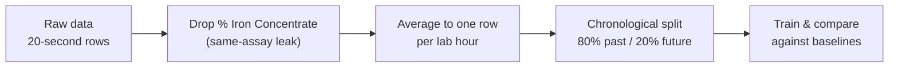

# Silica Concentrate Prediction — An Honest Look

Predicting **% silica in iron ore flotation concentrate** from plant sensor and lab assay data — and finding out how much the data really supports.

[](https://silica-flotation-prediction-gqfztqbcsflv654bugltep.streamlit.app/)

---

## Why silica matters

In iron ore flotation, silica is the main impurity carried into the concentrate. Steelmakers pay penalties for it, so concentrators run reverse flotation — reagents float the silica off and leave the iron behind — and operators adjust air flow, reagent dosing and froth levels to keep silica down without losing iron to the tailings.

The problem is feedback. Silica is confirmed by a **lab assay once an hour**, while the plant's sensors log every **20 seconds**. Between assays, operators are adjusting a process whose current quality they cannot see. A model that estimates silica from sensor readings — a soft sensor — would close that gap.

This project asks whether the plant's data actually supports such a model. The answer turned out to be more interesting than a high score.

## The short version

My first model scored **R² = 0.998**. That number was wrong.

It came from two forms of data leakage:

**1. A same-assay input.** `% Iron Concentrate` is measured in the same lab test as silica, and the two are strongly inversely related. A plant does not have the iron result before the silica result, so feeding it to the model meant predicting the answer from its twin. In the leaky model it accounted for roughly 75% of the feature importance; every genuine process variable scored 0.05 or below.

**2. A random split of 20-second rows.** Each lab result is stamped onto about 180 near-identical sensor rows. Shuffling placed rows from the same hour on both sides of the split, so the test set was never really unseen. The model recognised hours instead of learning the process.

Two clues in my own output should have given it away sooner: training and test scores were almost identical (0.9998 vs 0.9983), and Random Forest beat linear regression by roughly 200× on error — the signature of a model memorising lookalike rows rather than learning a relationship.



## Results

Test set: the final 20% of hours, held out by time. RMSE is in percentage points of silica.

| Model | R² | RMSE |
|---|---|---|
| Predict the training average | −0.001 | 1.145 |
| Random Forest, sensors only | 0.071 | 1.103 |
| Repeat last hour's assay | **0.612** | **0.713** |
| Random Forest, sensors + last hour | 0.592 | 0.731 |

*R² of 1 is perfect, 0 is no better than predicting the average, and negative is worse than that. RMSE is the typical error: "off by 0.71 percentage points of silica".*

**What this says about the plant:**

- Hourly sensor readings alone explain about 7% of silica's variation — barely better than guessing the average.
- Silica moves slowly, so last hour's lab result is by far the strongest predictor of this hour's.
- Adding the sensors on top of that assay does **not** beat simply repeating it. At hourly resolution, the sensors carry no extra information about silica.

A model that cannot beat "repeat the last measurement" should not be deployed as if it could. Reporting that clearly is the point of this project.

## Explore it

The [Streamlit app](https://silica-flotation-prediction-gqfztqbcsflv654bugltep.streamlit.app/) covers:

- the leaky and honest scores side by side, with a plain-language explanation of the gap
- a comparison of all four models by R² or RMSE
- actual versus predicted silica, hour by hour, with a date filter and model picker
- what the best model relies on, by feature importance

## Data

Public iron ore flotation plant dataset (Kaggle), March–September 2017, from a Brazilian concentrator.

| Group | Columns |
|---|---|
| Feed quality (hourly lab) | `% Iron Feed`, `% Silica Feed` |
| Reagents | `Starch Flow`, `Amina Flow` |
| Pulp conditions | `Ore Pulp Flow`, `Ore Pulp pH`, `Ore Pulp Density` |
| Flotation columns | air flow and froth level for columns 1–7 |
| Output (hourly lab) | `% Iron Concentrate`, `% Silica Concentrate` (target) |

The raw file is around 200 MB and is not included here. Download it from Kaggle and point the notebook's `path` variable at it.

## Method

- **Aggregation:** one row per lab hour, matching the rate at which the target actually changes (about 4,000 rows instead of 736,000).
- **Validation:** chronological 80/20 split, no shuffling, so the model is only ever tested on later hours.
- **Leak removal:** `% Iron Concentrate` dropped, since it is not available at prediction time.
- **Lag feature:** `silica_prev_hour`, the previous hour's assay, with values not carried across gaps in the record.
- **Model:** Random Forest, 300 trees, minimum 5 hours per leaf to prevent memorising individual hours.
- **Baselines:** predicting the training mean, and persistence (repeating the last assay), reported alongside every model.
- **Dropped from the original version:** feature scaling, which does nothing for tree models, and correlation-based feature selection, since a weak linear correlation does not mean a feature is useless to a tree.

## Repository

| File | What it is |
|---|---|
| `minig-data.ipynb` | Full analysis: the original leaky version and the corrected one |
| `app.py` | Streamlit app exploring the corrected results |
| `silica_results.csv` | Test-period actuals and each model's predictions |
| `rf_importances.csv` | Feature importances of the best model |
| `requirements.txt` | Dependencies |

## Run locally

```bash
git clone https://github.com/BrandonKaza32/Silica-flotation-prediction.git
cd Silica-flotation-prediction
pip install -r requirements.txt
streamlit run app.py
```

The app reads the two small CSVs, so it starts instantly without the raw dataset. To regenerate them, run the notebook's export cell after downloading the data from Kaggle.

## Limitations

- One plant, seven months. Another concentrator, or a different ore, may behave differently.
- The lag feature assumes last hour's assay is available when the prediction is made. If the lab reports later than that, a two-hour lag is the realistic test.
- Hourly averaging discards everything that happens within the hour, which is where a real soft sensor would most likely find its signal.
- Random Forest feature importances are unreliable when inputs are correlated, and flotation column readings are highly correlated with one another.

## Next steps

- Use sensor **trends** within the hour (rolling means, rates of change) instead of hourly averages.
- Predict the hour-to-hour **change** in silica, where sensors may matter more than they do for the level.
- Test a two-hour lag, to match the lab's real reporting delay.
- Compare against a simple control-oriented baseline, such as reagent dosing rules already used on site.

## What I took from it

A score that looks too good usually is. The fix was not a better model but a better question: what would the plant actually know at the moment of prediction, and what is the simplest thing it could do instead?

---

**Brandon Kazangarare** — Mining Engineering, Central South University · [GitHub](https://github.com/BrandonKaza32)
